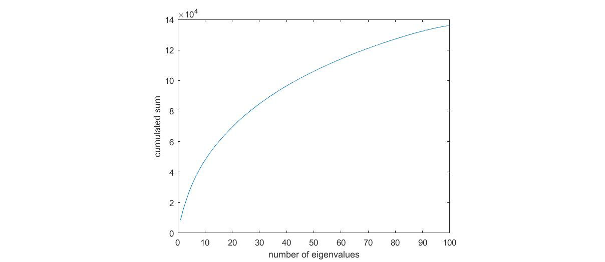
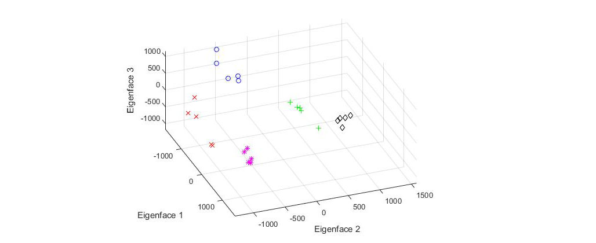
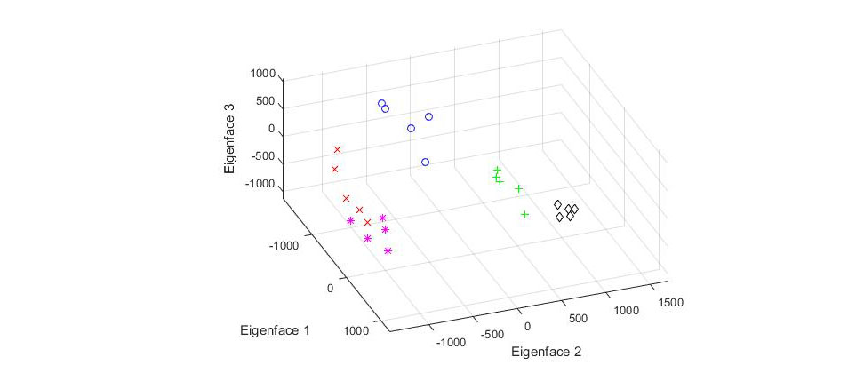
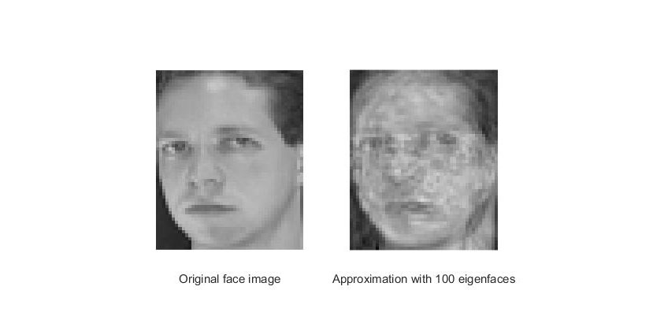
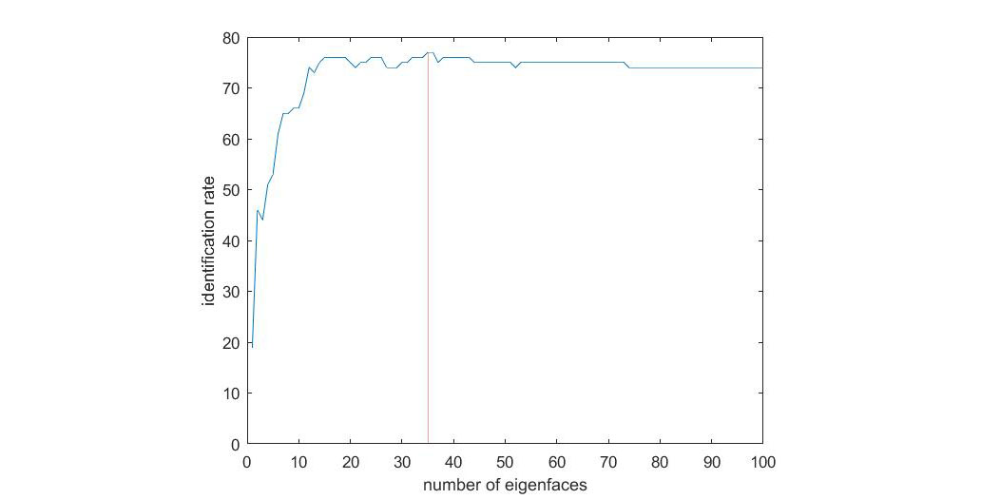

# Face recognition using Eigenfaces

Introduction 

## Exercice 1 : Building the Eigenspace

[`Exercices/exercice1.m`](Exercices/exercice1.m).


### A. Computing the Eigenspace A

We build the eigenspace out of a set of images that can be found in `public/Images/Train_A` with the function `loadImagesinDirectory()` and 
`buildSpace()` like so:

```matlab
addpath \\datas\teaching\courses\image\Tpbiometry\public\Matlab
train_A = loadImagesInDirectory('\\datas\teaching\courses\image\Tpbiometry\public\Images\train_A\');
[Means, SpaceA, Eigenvalues] = buildSpace(train_A);
```

We now have access to the eigenspace (`SpaceA`) and the `Eigenvalues` of the image set in their corresponding `SpaceA`. 

**What is the maximum size of the eigenspace ?** As we have 100 eigenvalues we therefore have a maximum size for the eigenspace of 100. 

The eigenvalues can be interpreted as the amount of information that is carried out by each eigenvector. **Why is it so ?** Because an eigenvalue represents the factor by which a eigenvector is stretched by the transformation of coordinates. 

### B. Plotting tge cumulative sum of eigenvalues

We can plot the cumulative sum of eigenvalues with the following matlab instructions: 

```matlab
Cumulated = cumsum(Eigenvalues);
plot(Cumulated);
```

We then have the following curve:


**Please comment the curve**: As it is cumulative, the curve is growing. However, as we add eigenvalues, they contain less and less information. This is why the curve is similar to a logarithmic function.

### C. Approximating the first image

We can rebuild the face using the `approximateImage()` function. We can change the values of the number of eigenfaces used as so:

```matlab
figureHandle1 = approximateImage('\\datas\teaching\courses\image\Tpbiometry\public\Images\train_A\s1_1.jpg',Means,SpaceA,12);
figureHandle2 = approximateImage('\\datas\teaching\courses\image\Tpbiometry\public\Images\train_A\s1_1.jpg',Means,SpaceA,40);
figureHandle3 = approximateImage('\\datas\teaching\courses\image\Tpbiometry\public\Images\train_A\s1_1.jpg',Means,SpaceA,75);
figureHandle4 = approximateImage('\\datas\teaching\courses\image\Tpbiometry\public\Images\train_A\s1_1.jpg',Means,SpaceA,100);
```


**Can we rebuild the first image perfectly ?** Yes we can, if we use all the eigenvalues (100), we have all the information needed to rebuild the image. We can do so because the image in question was used to build the eigenspace in the first place.

### D. Projecting and plotting in the face space

Using routines `projectImages()` and `plotFirst3Coordinates()`, we manage to plot the coordinates of the five training faces of the first five training individuals on the 3 most significantes eigenvectors of `SpaceA`. We will then plot a total of 25 points on to the graph. We can observe the following graph:



**Please comment the curve**: On this graph we can see 5 groups of points (with different colors). Each group of points represents the five pictures of one person. We can see that the points of one group (ie of one person) don't have the same coordinates, that comes from the fact that each picture isn't the same (point of vue, lighting...) even if it represents the same person.

## Exercice 2 : Identification

All the code explained can be found in file [`Exercices/exercice2.m`](Exercices/exercice2.m).

### A. Projecting and plotting test_A

We have used the function `projectImages()` to project the `test_A` images on the `Space_A` which has been calculated in the `exercice1.m` file. We now have five points for the five first people of `test_A` ploted in `Space_A` as so: 



We can see that the two figures are similar but are not the same which is normal because the two set of images are not the same. The photos are of the same people but there not exactly the same photos (lighting changes, posture changes, glasses etc..) Nonetheless we can see that the two figures are similar in many ways. The group of points are approximately in the same position but are just slightly more scattered across the figure.

### B. Approximating s1_6.jpg

We try to rebuild the original first test image with the function approximateImage in the SpaceA created in exercice1.m file. We see that we can’t rebuild the original image even with all the eigenfaces possible (100) because this image in test_A wasn’t present during the training phase in exercice 1 when we were creating the face space.



### C. Computing the identification rates (first face)

We can use the `identify()` function with the projected images of `test_A` in `Space_A` against the enrolled identities (`train_A` in `Space_A`) like so:

```matlab
model_projection=projectImages(train_A, Means, SpaceA);
model_first = model_projection(1:5:end,:); %Only the first image of the model

test_projection=projectImages(test_A, Means, SpaceA);

test_rate=zeros(1,100); #Initializing null matrix

for i=1:100
    test_rate(i) = identify(model_first,test_projection,i,1);
end

plot(test_rate)
```

With this graph we found that the best identification rate is found with 35 eigenfaces and its value is 77%. As predicted the identification rate increases with the number of eigenfaces used, but it reaches quickly a limit of identification.



### D. More identification rates (mean faces)

